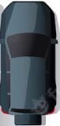

# Multi-Trailer Autonomous Parking

Path planning and simulation for a truck with multiple trailers in a 2D obstacle environment. The project implements **A\*** and **RRT** (Rapidly-exploring Random Trees) planners to find collision-free paths from a start pose to a goal pose, with visualization via Pygame.

## Demo

**Final project video** — path planning and execution in the parking environment:

<video src="Final_Project_Video.mp4" controls width="640">
  Your browser does not support the video tag. You can <a href="Final_Project_Video.mp4">download the video</a> instead.
</video>

## Features

- **Multi-trailer kinematics**: Truck plus configurable number of trailers with realistic dynamics (velocity, steering, trailer coupling).
- **Two planners**:
  - **A\*** — Graph search with discrete control inputs (velocity × steering), Reeds–Shepp–based cost-to-go heuristic, and collision checking.
  - **RRT** — Sampling-based planner with goal biasing and obstacle-aware sampling; uses Reeds–Shepp path length for nearest-neighbor and steering.
- **Obstacle environment**: Parking-lot style layout (walls, parked cars, obstacles) defined in `environment.py`.
- **Visualization**: Pygame window showing the truck and trailers, obstacles, and (for RRT) the exploration tree.

## Project Structure

| File | Description |
|------|-------------|
| `settings.py` | Global config: grid size, vehicle dimensions, time step, max steering angle, Pygame display. |
| `environment.py` | Environment with obstacles; `truck_trailer` class for rendering and collision checks. |
| `utils.py` | Helpers: cost-to-go (Reeds–Shepp + trailer terms), `blitRotate` for drawing, control matrix generation. |
| `A_star.py` | A\* planner: forward simulation, node expansion, path extraction and visualization. |
| `RRT.py` | RRT planner: sampling, nearest neighbor, steering, tree growth, path extraction. |
| `truck.png`, `trailer.png` | Sprites for truck and trailer (see below). |

**Vehicle sprites used in the simulation:**

| Truck | Trailer |
|-------|---------|
|  |  |

## Requirements

- Python 3.7+
- **pygame** — visualization and collision (rects)
- **numpy** — arrays and math
- **scipy** — used by RRT for truncated normal sampling
- **reeds_shepp** — Reeds–Shepp path length for cost and heuristics

## Installation

1. Clone the repository:
   ```bash
   git clone <repository-url>
   cd multi-trailer-autonomous-parking
   ```

2. Create and activate a virtual environment (recommended):
   ```bash
   python -m venv venv
   source venv/bin/activate   # Windows: venv\Scripts\activate
   ```

3. Install dependencies:
   ```bash
   pip install pygame numpy scipy reeds-shepp
   ```
   If `reeds-shepp` is not found on PyPI, try `pip install reeds_shepp` or install from a compatible source.

## Usage

### Run A\* planner

Uses a fixed start and goal; plans and then animates the path.

```bash
python A_star.py
```

Start and goal are set in the `if __name__ == "__main__"` block (e.g. `start = (20.0, 100.0, ...)`, `goal = (200.0, 150.0, ...)`). Edit these to change the scenario.

### Run RRT planner

Plans with RRT and then shows the path and (optionally) the tree.

```bash
python RRT.py
```

Start and goal are set at the bottom of `RRT.py`. The script may run for a while (e.g. up to `max_time` seconds) before finding a path or timing out.

### Run environment / truck demo

Runs a simple kinematic simulation of the truck and trailers without planning (keyboard/scripted motion demo).

```bash
python environment.py
```

## Configuration

Edit `settings.py` to adjust:

- **Grid**: `grid_width`, `grid_height`, `pixels_per_meter`
- **Vehicle**: `car_length`, `car_width`, `trailer_length`, `trailer_width`, `trailer_gap`
- **Motion**: `time_step`, `sim_time`, `max_turning_angle`
- **Obstacles**: `obstacle_height` (and obstacle layout in `environment.create_obstacles()`)

Obstacles and number of trailers are defined in `environment.py` (e.g. `truck_trailer(3)` for 3 trailers).

## State Representation

- **Position**: `(x, y)` in meters in the world frame.
- **Orientations**: List of angles in **degrees** — `orientations[0]` is the truck heading, `orientations[1]` the first trailer, etc. (relative/global as used in the kinematics in `A_star.simulate_forward` and `environment`.)

Start and goal are tuples `(x, y, orientations)` with `orientations` as a numpy array or list of length `1 + num_trailers`.

## License

This project is licensed under the GNU General Public License v3.0. See the [LICENSE](LICENSE) file for details.

## Related Files

- [Trailer_Parking_Project_report.pdf](Trailer_Parking_Project_report.pdf) — Project report.
- [Final_Project_Video.mp4](Final_Project_Video.mp4) — Demo video (also embedded in the [Demo](#demo) section above).
